# Ad Studio Light 使い方マニュアル（概要編）

Meta広告（Facebook / Instagram）の「成果分析 → 勝ちパターン抽出 → 新クリエイティブ生成」を1台のPCで完結できるツールです。このマニュアルでは、各画面で何ができるかを一通り紹介します。

> 📷 掲載しているスクリーンショットはすべて**デモモード**（`npm run demo`）の画面です。表示されているのは架空の化粧品ブランド「LUMINA（サンプル）」のダミーデータで、実在のアカウント・数値ではありません。お手元でも同じ画面をAPIキー無しで再現できます。

セットアップ手順・環境変数・トラブルシューティングは [README](../README.md) を参照してください。

---

## 全体の流れ

```
📊 分析      広告レポート / 優先順位 / 勝ちセグメント
   ↓         → 実績から「勝ち広告」と「伸ばすべき配信先」を特定
🎨 生成      勝ち分析再現 / バナー作成 / 素材から生成 / バリエーション作成
   ↓         → 勝ちクリエイティブを起点にAIで新案を量産
📚 学習      生成履歴
             → 入稿したバナーの勝敗を自動追跡し、次の生成に反映
```

---

## 🚀 初めての方へ — 最初の10分

初回だけ [アカウント管理](#accounts) での設定が必要です。設定後は「分析 → 生成 → 学習」のループを回すだけになります。まず画面を触ってみたいだけなら `npm run demo`（設定不要）でOKです。

1. [アカウント管理](#accounts) で「アカウントを追加」→ 分析したい広告アカウントを登録する
2. 同じ画面で「同期」を押し、Metaから実績を取り込む
3. ホームでアカウントを選んで [広告レポート](#report) を見る。[優先順位](#priority) で★評価も確認
4. [勝ち分析再現](#winning) で勝ち広告を選ぶ → AIが分析 → 新案6案を生成
5. [生成履歴](#history) で「採用」→ 発行された入稿名でMetaに入稿すると、勝敗が自動で紐づく

---

<a id="home"></a>

## ホーム画面

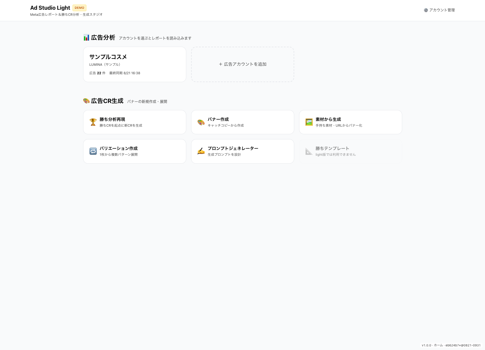

起動して最初に表示される画面です。上段が**広告分析**、下段が**広告CR生成**の入口になっています。

- **広告分析**: 登録済みの広告アカウントがカードで並びます。カードをクリックするとそのアカウントの広告レポートが開きます
- **広告CR生成**: 各生成機能（勝ち分析再現・バナー作成など）へ直接ジャンプできます
- 右上の **⚙ アカウント管理** から、分析対象アカウントの登録・同期を行います
- デモモードで起動している間は、ロゴ横に **DEMO** バッジが表示されます

---

<a id="report"></a>

## 📊 広告レポート — クリエイティブ別の成果分析

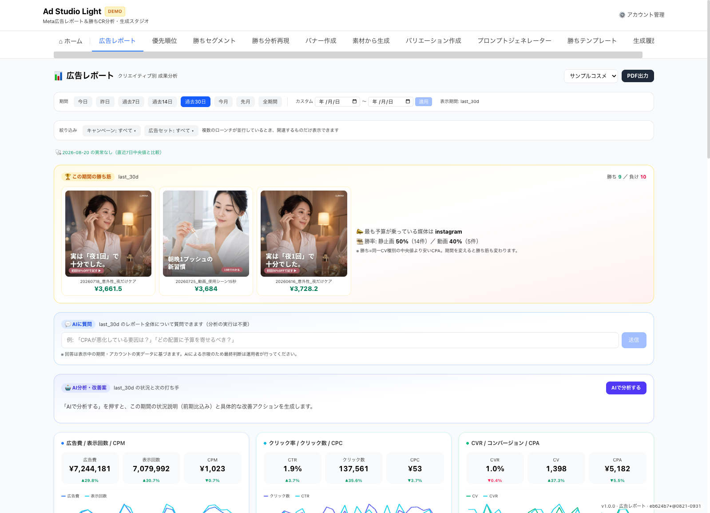

アカウントの広告実績を、期間を切り替えながらクリエイティブ単位で深掘りする画面です。

- **期間切替**: 今日／昨日／過去7日／過去30日／今月／先月／全期間／カスタム期間
- **絞り込み**: キャンペーン・広告セット単位で表示対象を絞れます（複数ローンチの並行時に便利）
- **異常検知アラート**: 消化急増・配信停止疑い・CPA急騰などを直近7日の中央値と比較して自動検知
- **🏆 この期間の勝ち筋**: 期間内のCPA上位クリエイティブと、媒体・静止画/動画の勝率をサマリー表示
- **💬 AIに質問**: 表示中のレポート全体について自然文で質問できます（例:「CPAが悪化している要因は？」）
- **🤖 AI分析・改善案**: ボタンひとつで、前期比を踏まえた状況説明と具体的な改善アクションを生成

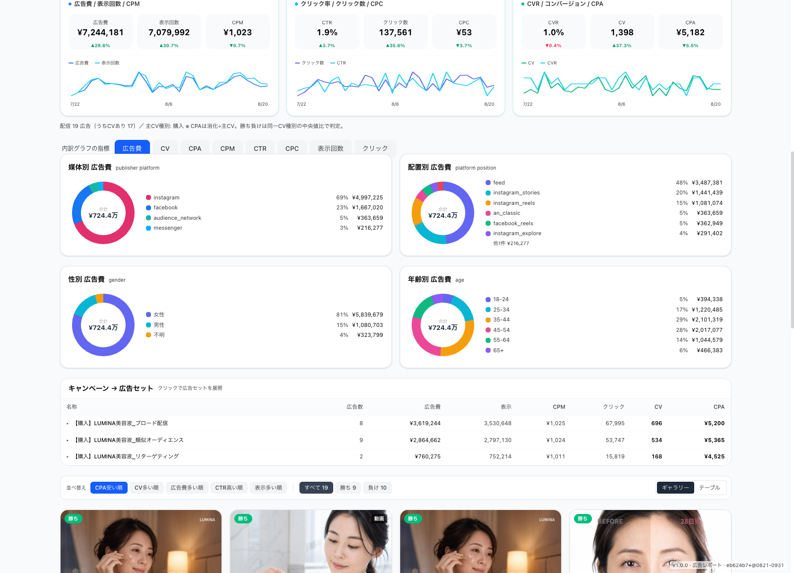

- **KPIカード**: 広告費・表示回数・CPM／CTR・クリック・CPC／CVR・CV・CPA を前期比つきで表示し、日次推移をグラフ化
- **内訳グラフ**: 媒体別・配置別・性別・年齢別の内訳を、広告費／CV／CPA など8指標で切替表示
- **キャンペーン → 広告セット**: 階層をクリックで展開しながら数値を確認できるテーブル

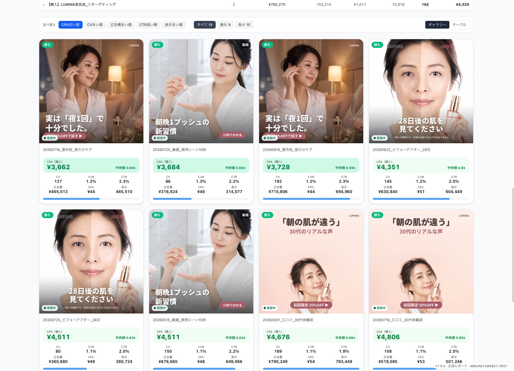

- **クリエイティブギャラリー**: 各広告をサムネイル＋主要指標のカードで一覧。**勝ち／負け**バッジと配信状況を表示
- 勝ち負けの判定は「同一CV種別の中央値よりCPAが安いか」。期間を変えると勝ち筋も変わります
- 並べ替え（CPA安い順・CV多い順など）、勝ち/負けフィルタ、ギャラリー⇄テーブル表示の切替に対応
- **PDF出力**ボタンでレポートをそのまま共有用に書き出せます

---

<a id="priority"></a>

## 📊 優先順位 — 伸ばす広告・止める広告を一覧化

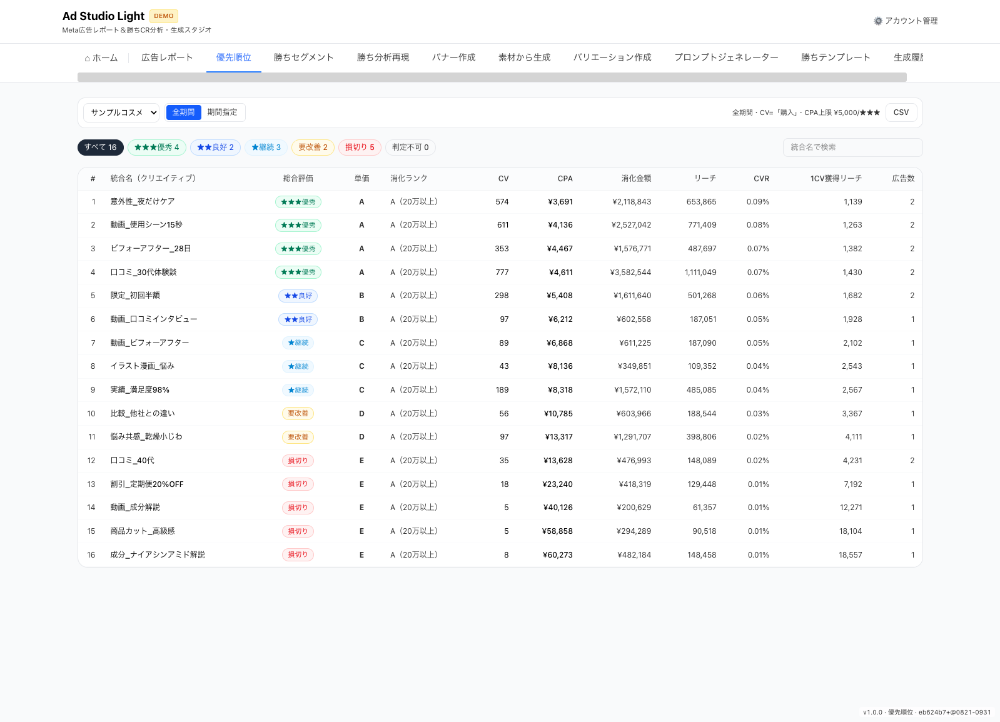

同じクリエイティブを複数キャンペーンに入稿していても、広告名から**名寄せ（統合名）**して合算評価する画面です。「どのクリエイティブに予算を寄せ、どれを止めるか」の判断に使います。

- **CPAランク A〜E**: 設定したCPA上限（評価設定で変更可）に対する良し悪し
- **消化ランク**: 消化金額の規模（十分に検証できた消化か）
- **総合評価**: ★★★優秀 → ★★良好 → ★継続 → 要改善 → **損切り** の5段階
- 評価別フィルタ・統合名検索・**CSV出力**に対応
- 期間指定での評価には PostgreSQL が必要です（全期間評価はDB無しでも動きます）

---

<a id="segments"></a>

## 📊 勝ちセグメント — 誰に・どこに配信すると勝てるか

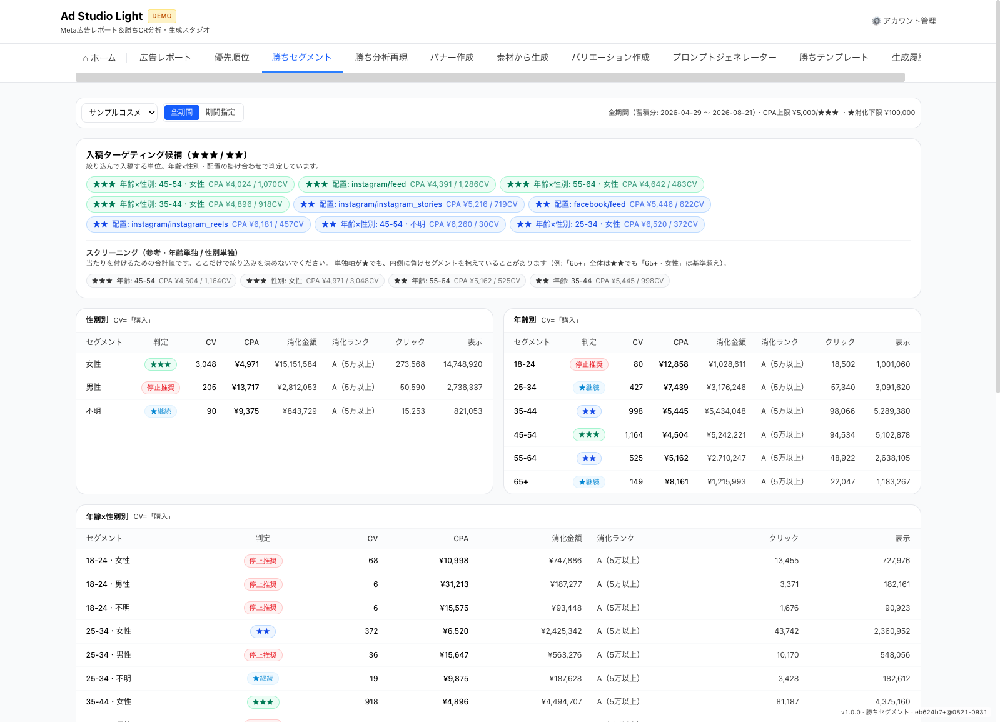

性別・年齢・配置ごとの実績を蓄積し、「絞り込んで入稿する価値のあるセグメント」を抽出する画面です。

- **入稿ターゲティング候補**: 年齢×性別・配置の掛け合わせで★★★／★★のセグメントを提示。そのまま入稿時の絞り込みに使えます
- **スクリーニング（年齢単独／性別単独）**: 当たりを付けるための参考値。単独軸が★でも内側に負けセグメントを抱えることがあるため、最終判断は掛け合わせで
- **性別別・年齢別・年齢×性別別・配置別**の詳細テーブル
- **入稿用名称ジェネレーター**: `YYYYMMDD_接頭辞_素材名` 形式の入稿名を発行。この形式で入稿すると優先順位タブの名寄せに正しく合流します
- この画面は PostgreSQL が必要です（デモモードは組み込みDBで動作します）

---

<a id="winning"></a>

## 🎨 勝ち分析再現 — 勝ちクリエイティブを起点に新案を生成

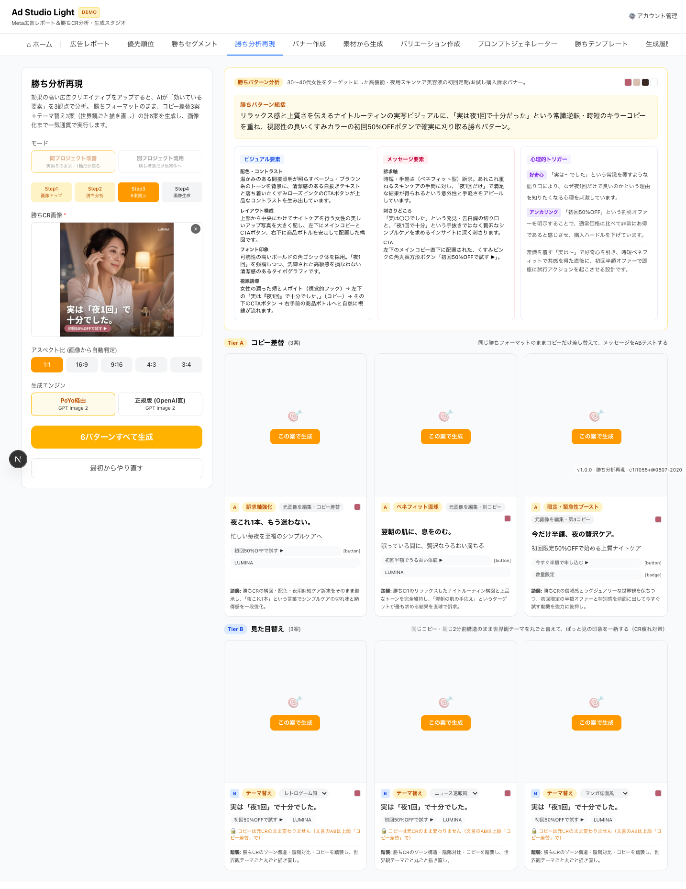

このツールの中核機能です。成果の出ているクリエイティブをアップすると、AIが「効いている要素」を3観点で分析し、**勝ちフォーマットを保ったまま**新しい案を作ります。

- **Step1 画像アップ → Step2 勝ち分析 → Step3 6案提示 → Step4 画像生成** の4ステップ
- 生成されるのは **コピー差替3案 ＋ テーマ替え3案（世界観ごと描き直し）** の計6案
- **📊 Metaの勝ちCRから選ぶ**: 同期済みの実データからCPA順に勝ちクリエイティブを選択可能（アップロード不要）
- **モード切替**:
  - **同プロジェクト改善** — 実物そのまま・1軸だけ振る
  - **別プロジェクト流用** — 勝ち構造だけを別ブランド・別案件へ移植
- アスペクト比は画像から自動判定。生成エンジン（GPT Image 2 系）を選択できます

---

<a id="create"></a>

## 🎨 バナー作成 — キャッチコピーからAIバナーを生成

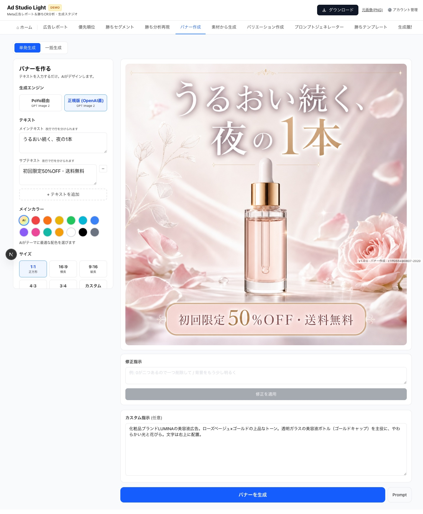

テキストを入力するだけで、背景もテキストデザインもAIが組み立てる新規作成画面です。

- **テキスト**: メイン／サブを行単位で指定（複数追加可）
- **メインカラー・サイズ（1:1／16:9／9:16／4:3／3:4／px指定）・フォント・人物の有無**を指定。いずれも「AIおまかせ」可
- **参照URL / 参照画像**: LPや既存バナーのテイストを参考にできます。参照画像は「デザインの参考」か「そのまま使う（人物・商品を描き替えず配置）」を選択
- **ロゴ**: AI加工なしでそのまま合成
- **カスタム指示**: プロンプトジェネレーターの出力や自由記述の指示を追加
- **単発生成／一括生成**の切替に対応。生成結果はすべて「生成履歴」に残ります

---

<a id="source"></a>

## 🎨 素材から生成 — LPや手持ち素材からバナー化

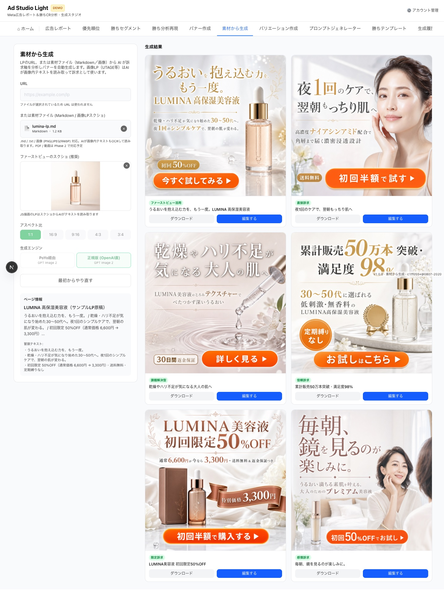

LPのURL、または素材ファイル（Markdown／画像）を渡すと、AIが**訴求軸を抽出**してからバナーを自動生成します。

- URL入力のほか、`.md` / `.txt` / 画像ファイルのドロップに対応
- 画像LP（UTAGE等）は、AIが画像内のテキストを読み取って訴求として使います
- JS描画で本文が取れないLPは、ファーストビューのスクショを添付すると精度が上がります

---

<a id="variation"></a>

## 🎨 バリエーション作成 — 1枚から6テイストに展開

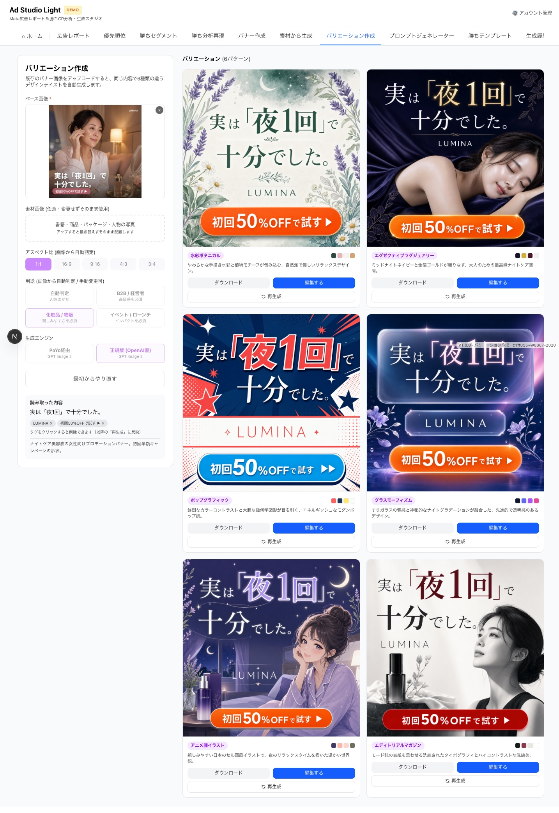

既存バナーを1枚アップすると、同じ内容のまま**6種類の異なるデザインテイスト**を自動生成します。当たりのコピーを維持したままデザイン検証の弾を増やしたいときに使います。

- **素材画像**: 書籍・商品パッケージ・人物写真などを渡すと、**描き替えずそのまま配置**します
- **用途プリセット**: B2B/経営者（高級感）・化粧品/物販（親しみやすさ）・イベント/ローンチ（インパクト）を自動判定または手動選択

---

<a id="prompt"></a>

## 🎨 プロンプトジェネレーター — 参考デザインをプロンプト化

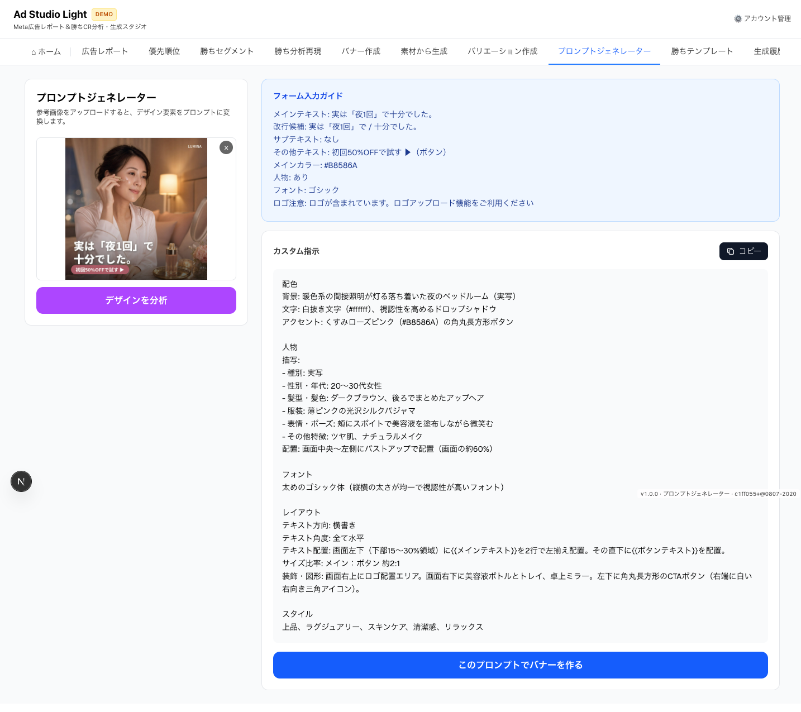

参考にしたいバナー画像をアップすると、配色・構図・トーンなどのデザイン要素を**画像生成用プロンプト**に変換します。出力は「バナー作成」のカスタム指示にそのまま渡せます。

---

<a id="history"></a>

## 📚 生成履歴 — 採用→自動追跡→次の生成に反映

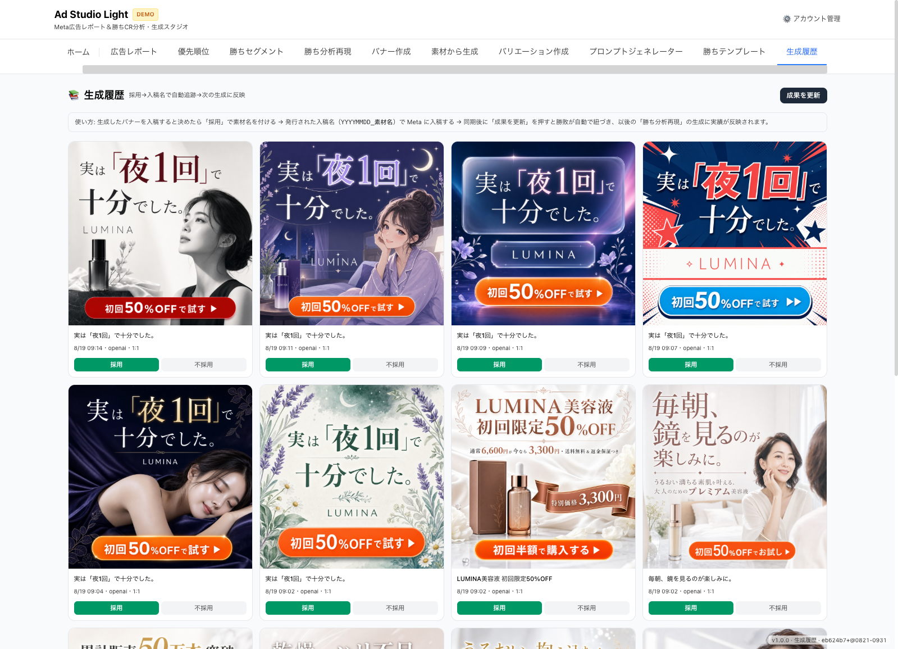

生成した全バナーの履歴です。ここが**学習ループ**の起点になります。

1. 入稿すると決めたバナーで「**採用**」を押し、素材名を付ける
2. 発行された入稿名（例 `20260809_夏の限定訴求A`）を**そのままMetaの広告名にして入稿**
3. 同期後に「**成果を更新**」を押すと、勝敗が自動で紐づく
4. 以降の「勝ち分析再現」は、蓄積された「勝った切り口・負けた切り口」を踏まえて生成するようになる

---

<a id="accounts"></a>

## ⚙️ アカウント管理 — 分析対象の登録・同期・評価基準

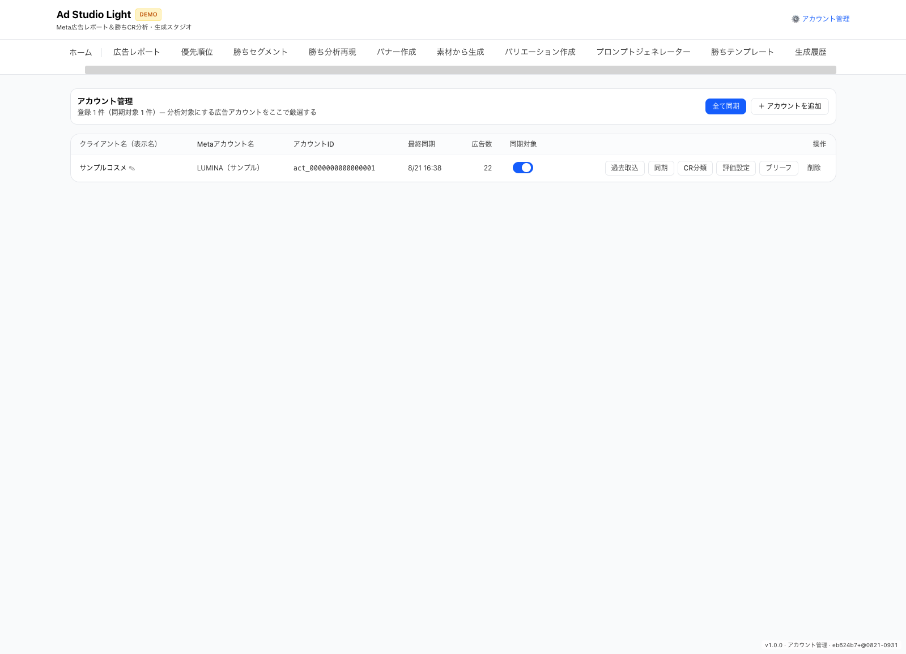

ヘッダー右上から開きます。分析対象にする広告アカウントをここで管理します。

- **アカウントを追加**: トークンでアクセスできるアカウントの一覧から選んで登録
- **同期**: Metaから直近の実績を取り込み（「全て同期」で一括）
- **過去取込**: 過去実績の月次一括バックフィル（要PostgreSQL）
- **CR分類**: クリエイティブの特徴（CreativeTraits）をAIで分類し、勝ちパターン抽出に利用（詳細は下記）
- **評価設定**: 報酬単価・CPA上限・ROAS基準など、★評価やランクの基準をアカウントごとに設定（詳細は下記）
- **ブリーフ**: ブランドのトーンや訴求の前提を登録し、生成時に反映

### CR分類の詳細

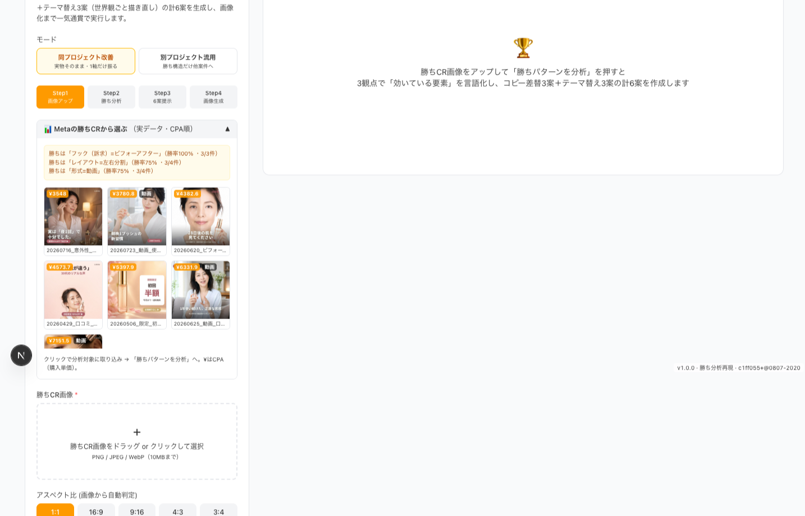

クリエイティブ画像そのものをAI（vision）に見せて「見た目の特徴」を分類し、蓄積する処理です。数値の同期とは別ルートで、次のように動きます。

1. 同期済みの実績から、CV種別ごとにCPA基準で**勝ちCR・負けCR**を判定
2. そのクリエイティブ画像を取得し、AIが固定の分類語彙で特徴をタグ付け — **訴求フック**（口コミ・ビフォーアフター・限定オファー等）／**印象**／**被写体**／**配色**／**構図**／**文字量**／**CTAボタンの有無**
3. 結果をDBに蓄積。**分類済みのCRはスキップ**され、新規の勝ち/負けCR分だけ処理されます（差分実行）

分類した結果は次の2箇所で効きます：

- **勝ち分析再現の「📊 Metaの勝ちCRから選ぶ」** — ここに並ぶのは「勝ち判定 かつ CR分類済み」のCRだけです。分類が走っていないと候補に出ません
- **勝ちパターン要約** — 上のスクショ上部のように「勝ちは『フック（訴求）=ビフォーアフター』（勝率100%・3/3件）」といった特徴の集計が表示され、生成時のプロンプトにも参考情報として渡ります

**普段このボタンを押す必要はありません。** 同期・過去取込のあとに自動実行されます（分類が失敗しても同期自体は成功扱いになる設計です）。「CR分類」ボタンは自動実行が失敗したときや、すぐ回したいときの手動再実行用で、押すと「新規◯件を分類（累計◯件）」と結果が表示されます。なお、Metaが画像URLを返さない一部のCRは分類できず、ピッカーにも表示されません（既知の制約）。

### 評価設定の詳細

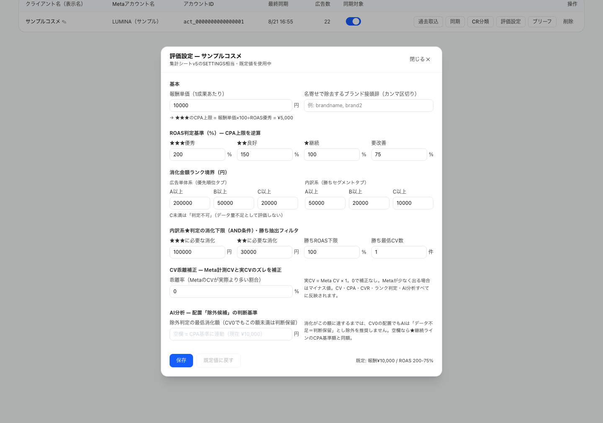

優先順位・勝ちセグメントの★評価やランクは、すべてこの画面の基準から計算されます。**保存すると即反映**されます（ランクは保存値ではなく表示のたびに計算されるため、過去分も含めて基準が切り替わります）。設定はアカウント（クライアント）ごとの上書きで、「既定値に戻す」でいつでもリセットできます。

| 項目 | 意味 |
|------|------|
| **報酬単価（1成果あたり）** | 1CVで得られる報酬・売上額。すべてのCPA基準の起点になります |
| **名寄せで除去するブランド接頭辞** | 広告名の先頭に付くブランド名等をカンマ区切りで登録。優先順位タブの統合名から除去して名寄せ精度を上げます |
| **ROAS判定基準（%）** | ★★★優秀／★★良好／★継続／要改善 の4閾値。各評価のCPA上限は **報酬単価×100÷ROAS%** で逆算されます（例: 報酬¥10,000・優秀200% → ★★★のCPA上限は¥5,000。画面上に計算結果が表示されます） |
| **消化金額ランク境界（円）** | 消化ランクA/B/Cの下限額。広告単体系（優先順位タブ）と内訳系（勝ちセグメントタブ）で別々に設定します。**C未満は「判定不可」**＝データ量不足として評価しません |
| **内訳系★判定の消化下限** | 勝ちセグメントで★★★／★★と判定するには、ROAS基準に**加えて**この消化額も必要（AND条件）。少額で偶然良い数字が出たセグメントを★にしないための下限です |
| **勝ち抽出フィルタ** | 「勝ち」として抽出する条件（勝ちROAS下限・勝ち最低CV数） |
| **CV乖離補正** | Meta計測CVと実CV（カート実数など）のズレを補正する率。実CV = Meta CV ×（1−乖離率/100）。Metaが少なく出る場合はマイナス値。CV・CPA・CVR・ランク判定・AI分析のすべてに反映されます。0で補正なし |
| **AI分析 — 配置「除外候補」の判断基準** | CV0の配置でも、消化がこの額に達するまでAIは「データ不足＝判断保留」とし除外を推奨しません。空欄の場合は★継続ラインのCPA基準額と同額になります |

### ブリーフの詳細

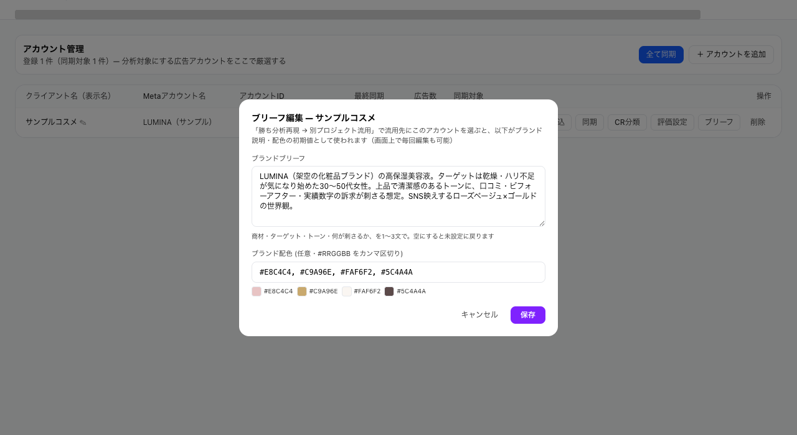

アカウントごとに**ブランドの前提知識**を登録しておく画面です。ここに書いた内容は、**「勝ち分析再現 → 別プロジェクト流用」で流用先にこのアカウントを選んだとき、ブランド説明・配色の初期値として自動投入**されます（生成のたびに画面上で編集も可能）。毎回ブランド説明を書き直す手間がなくなり、誰が生成しても訴求とトーンがぶれにくくなります。

**ブランドブリーフ** — 「①商材 → ②ターゲット → ③トーン → ④刺さる訴求（＋世界観・色）」の順で1〜3文にまとめるのがおすすめです。記入例（デモのダミー）：

> LUMINA（架空の化粧品ブランド）の高保湿美容液。ターゲットは乾燥・ハリ不足が気になり始めた30〜50代女性。上品で清潔感のあるトーンに、口コミ・ビフォーアフター・実績数字の訴求が刺さる想定。SNS映えするローズベージュ×ゴールドの世界観。

この例では「高保湿美容液（商材）／30〜50代女性（ターゲット）／上品で清潔感（トーン）／口コミ・ビフォーアフター・実績数字（刺さる訴求）／ローズベージュ×ゴールド（世界観）」が1つずつ入っています。長い資料を貼るより、この密度で短く書いた方が生成結果は安定します。空にして保存すると未設定に戻ります。

**ブランド配色（任意）** — ブランドカラーを `#RRGGBB` のカンマ区切りで登録します（例: `#E8C4C4, #C9A96E, #FAF6F2, #5C4A4A`）。入力するとスウォッチでプレビュー表示され、`#` は省略しても自動補完、不正な値は警告が出ます。登録しておくと流用生成時にブランドの色味が初期値として引き継がれます。

---

## 補足

- **勝ちテンプレート**タブは light 版では未提供です（グレーアウト表示）
- 勝ち判定の基準:「同一CV種別の中央値よりCPAが安い」。★評価の閾値は評価設定で変更できます
- データはすべて自分のPC内（`data/` または PostgreSQL）に保存されます。外部への通信は Meta / OpenAI / Google のAPI呼び出しのみです
- 機能ごとのDB要否・環境変数の詳細は [README](../README.md) を参照してください
