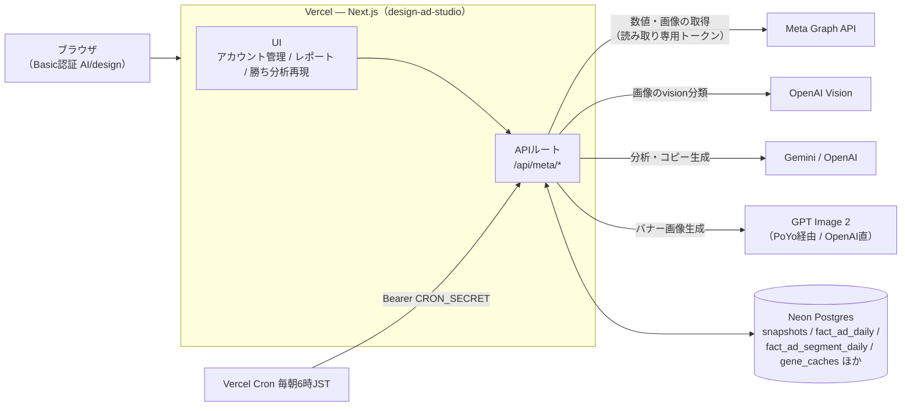
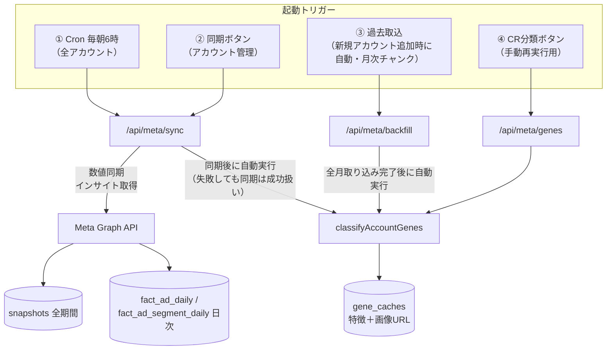
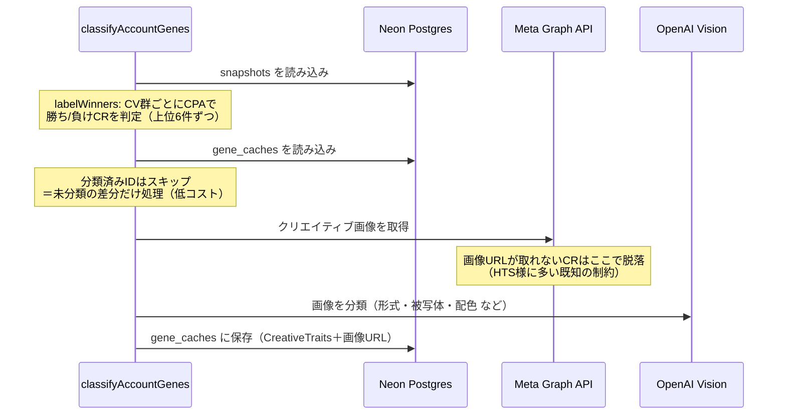
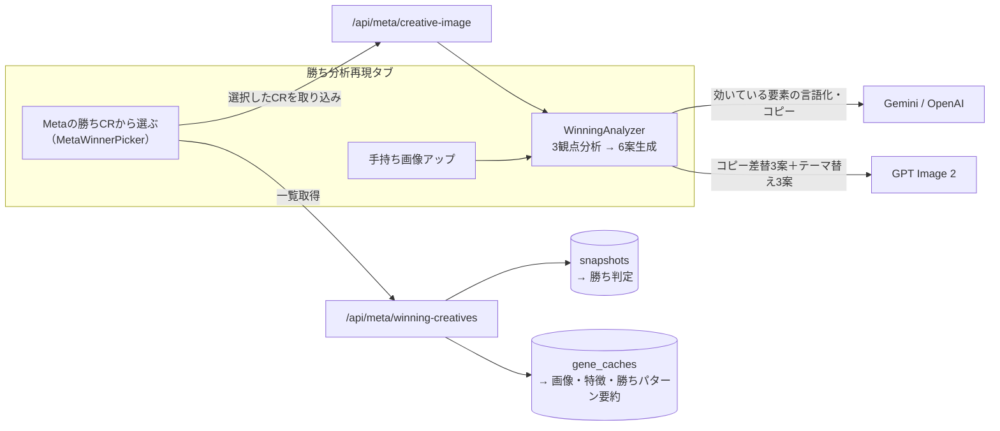

# Ad Studio 勝ちCR分析（genes分類）アーキテクチャ

Meta広告の**数値**と**クリエイティブ画像**を別ルートで取り込み、AIが「勝ちCRの見た目の特徴」をDBに蓄積 → 「勝ち分析再現」で新CR生成の起点にする仕組み。2026-07-14時点（genes分類の自動化込み）。

## 図1: 全体構成

## 図2: データ取り込み〜genes分類のトリガーと流れ

genes分類（`classifyAccountGenes` / `src/lib/meta/genes-sync.ts`）は**4つの入口すべてから同じ関数**が呼ばれる。

## 図3: genes分類の中身（1アカウント分）

## 図4: 「勝ち分析再現」での利用フロー

## 押さえておくポイント

| 項目 | 内容 |
|---|---|
| 数値と画像は別ルート | 数値（消化・CV・CPA）は同期で毎日更新。画像の特徴（genes）はvision分類で `gene_caches` に蓄積 |
| 差分実行 | 分類済みcreativeIdはスキップ。毎日Cronで走ってもAPIコストは新規の勝ち/負けCR分だけ |
| 失敗の切り離し | genes分類が失敗しても数値同期は成功扱い（レポートは止まらない） |
| ピッカーの表示条件 | 「勝ち判定」かつ「genes分類済み（画像URLあり）」のCRだけ表示。両方満たすアカウントが2社以上でプルダウン出現 |
| 既知の制約 | Metaが画像URLを返さないCR（`no image_url/thumbnail_url`）は分類不可→ピッカー非表示 |
